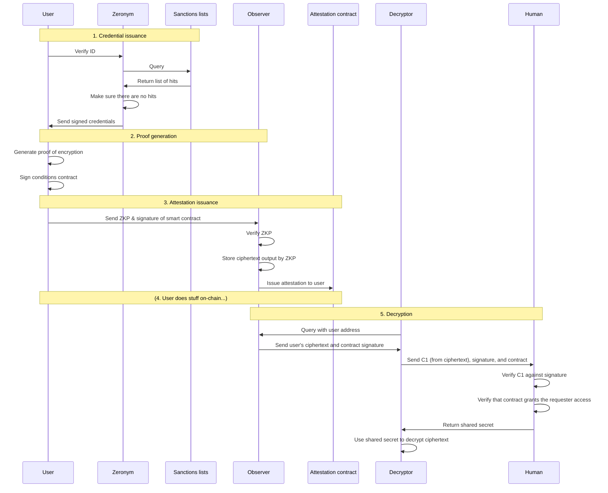
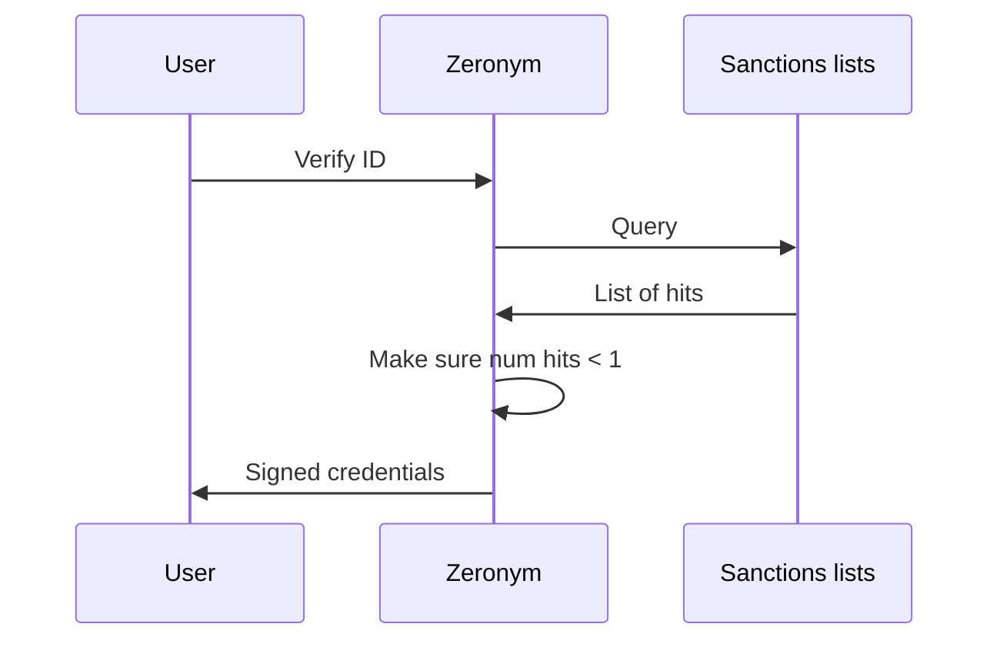
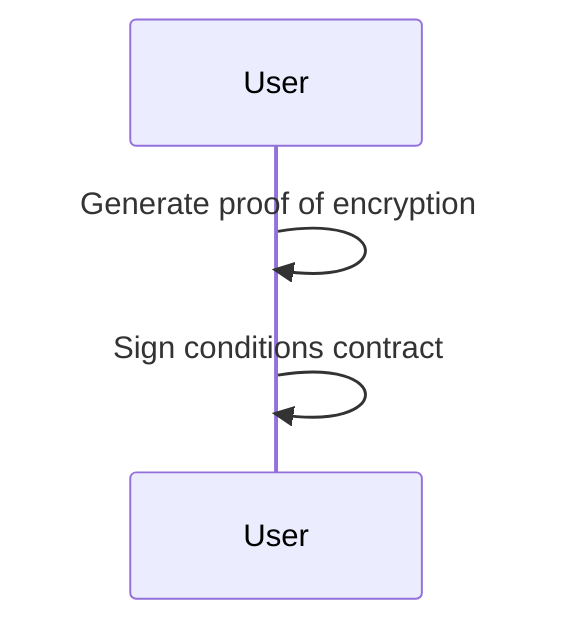
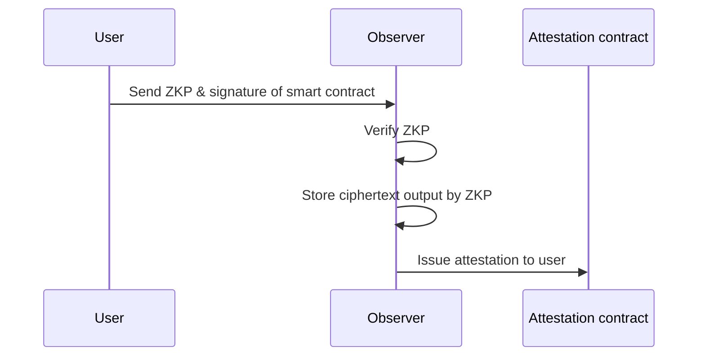
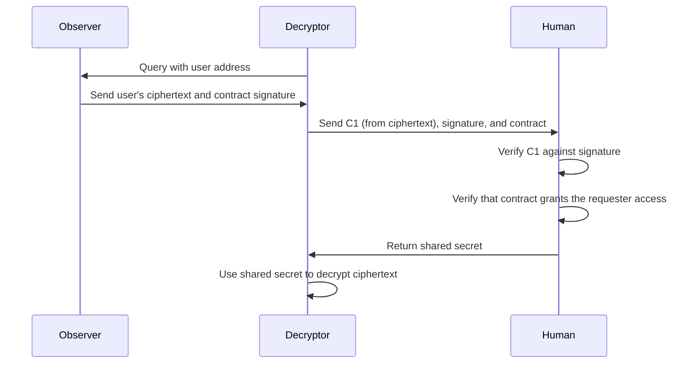

# Observer

The Observer is a primary component in the Clean Hands stack. In the Clean Hands flow, a user generates a ZKP to prove they have passed sanctions checks, and this ZKP outputs the ciphertext of the user's personal identifiable information (PII) and the user's associated blockchain address. This PII can be used to identify the user if their associated blockchain address is suspected of money laundering. The Observer's role in this system is to verify ZKPs, issue attestations to users with valid ZKPs, and to store the public outputs of these ZKPs so that the ciphertext can be decrypted, with the help of Human network, if necessary.

### Run

First, make sure you are running a MongoDB service.

Set environment variables. `SUI_PRIVATE_KEY` should be the output of the `sui keytool export` command.

    export NODEJS_SCRIPTS_PATH=./crates/observer/src
    export CIRCUIT_DIR=./crates/observer/circuits
    # You might want to modify the following
    export MONGODB_URI=mongodb://localhost:27017
    export CLEAN_HANDS_ISSUER_ADDRESS=3953516660401541564649985379958697237340496801951929947163239598560489169274
    # The following variables MUST be changed
    export ATTESTOR_PRIVATE_KEY=123 
    export OP_RPC_URL=abc
    export SUI_PRIVATE_KEY=123
    export SUI_PRIVATE_KEY_SCHEME=ed25519

From directory /human, execute

    cargo run --bin observer

### Diagrams

How the Observer fits into the Clean Hands flow in Zeronym.

#### Full flow

#### 1. Credential issuance flow

#### 2. Proof generation

#### 3. Attestation issuance

#### (4. On-chain activity)

#### 5. Decryption

